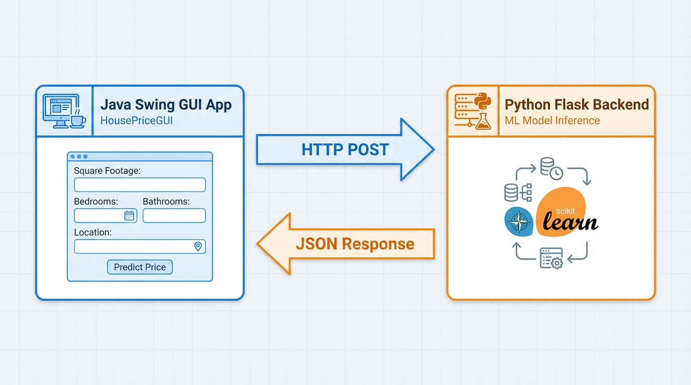
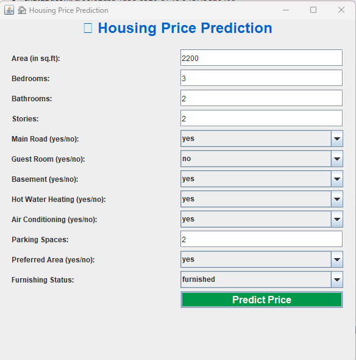
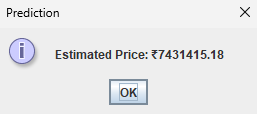

# House Price Prediction System (Java GUI + Python ML Backend)

A full-stack **cross-language machine learning application** that connects a **Java Swing desktop GUI** with a **Python Flask backend** for real-time house price prediction.  
The system demonstrates practical integration between a typed, compiled language (Java) and a dynamic ML environment (Python), making it an industry-style project.

---

## Project Overview

This application enables users to enter house attributes (area, bedrooms, bathrooms, stories) through a **Java Swing interface**.  
These features are sent via an **HTTP POST request** to a **Python Flask API**, which loads a trained **Scikit-learn regression model** and returns the predicted house price.

The result is displayed instantly in a Java popup — creating a smooth desktop ML experience.

---

## Features

### Java Swing GUI  
- Clean, simple user interface  
- Input validation for numerical fields  
- “Predict” button triggers ML inference  
- Instant popup with predicted house price  

### Python Machine Learning Backend  
- Trained regression model (10,000+ samples)  
- Preprocessing + model serialization (Pickle)  
- Fast inference with Scikit-learn  
- Flask API endpoint `/predict` for real-time predictions  

### Cross-Language Integration  
- Java → sends JSON payload  
- Python → returns JSON response  
- Decoupled architecture (GUI and ML are independent)  

---

## Architecture Diagram (ASCII)

```


```


---
## Folder Structure

```
House_Price_GUI_application/
│
├── python_app/            # Flask ML backend
│   ├── app.py
│   ├── model/house_model.pkl
│   ├── data/housing_dataset.csv
│   └── README.md
│
├── java_app/              # Java Swing UI
│   ├── src/HousePriceGUI.java
│   └── README.md
│
├── screenshots/           # GUI or backend images (optional)
│
└── README.md              # Root documentation (this file)
```


---

## Tech Stack

### **Frontend (GUI)**
- Java  
- Swing  
- Java HTTP Client  

### **Backend (ML Service)**
- Python  
- Flask  
- Scikit-learn  
- Pickle for model serialization  

### **Data**
- 10,000+ rows real-estate dataset  
- Preprocessed + trained regression model  

---

## How to Run the Project

### 1. Start the Python Backend

\`\`\`bash
cd python_app
pip install -r requirements.txt
python app.py
\`\`\`

Backend runs at:  
http://127.0.0.1:5000/predict


### 2. Run the Java GUI

\`\`\`bash
cd java_app
javac src/HousePriceGUI.java
java -cp src HousePriceGUI
\`\`\`

Make sure the Python backend is running first.

---

## Example Prediction Workflow

### Java sends:
\`\`\`json
{
  "area": 2500,
  "bedrooms": 3,
  "bathrooms": 2,
  "stories": 2
}
\`\`\`

### Python responds:
\`\`\`json
{
  "predicted_price": 7431415.18
}
\`\`\`

---

## Screenshots

```



```

---

## Why This Project Stands Out

- Real full-stack engineering  
- Combines **ML + API development + desktop GUI development**  
- Uses two different languages communicating over HTTP  
- Clean architecture demonstrating professional engineering practice  
- Excellent résumé and internship portfolio project  

---

## License

This project is provided for **educational and demonstration purposes**.


